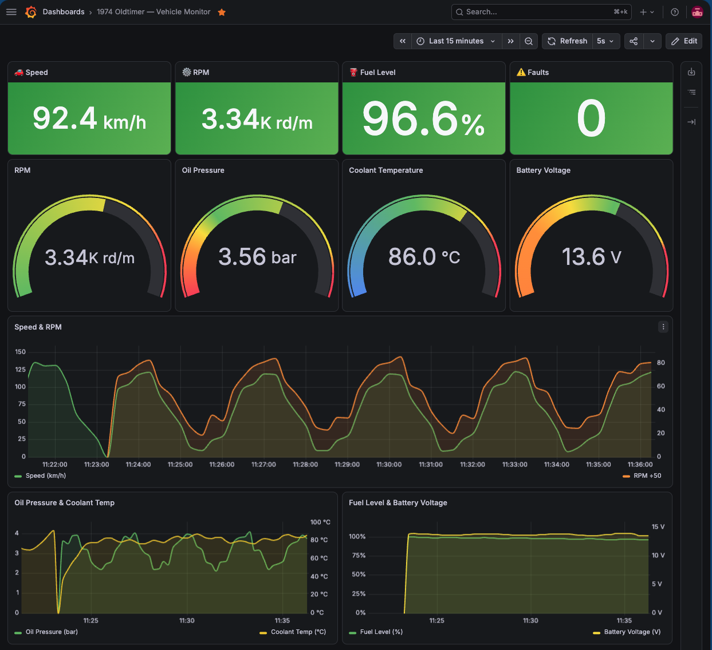

# OPC-UA Automotive Demo Stack

A complete local demo showing how OPC-UA vehicle telemetry flows from an edge server through Prometheus into a live Grafana dashboard.



## Architecture

```plaintext
┌─────────────────────────────────────────────────────────────────┐
│  Docker Compose Stack                                           │
│                                                                 │
│  ┌──────────────┐   OPC-UA    ┌───────────────┐  /metrics       │
│  │  opcua-server│ ──────────► │ opcua-exporter│ ──────────►     │
│  │  :4840       │  opc.tcp:// │  :9686        │                 │
│  └──────────────┘             └───────────────┘                 │
│        │                             │                          │
│        │ Simulated vehicle data      │ Prometheus scrape        │
│        │ (7 sensors, every 2s)       ▼                          │
│        │                      ┌────────────┐                    │
│        │                      │ Prometheus │                    │
│        │                      │  :9090     │                    │
│        │                      └─────┬──────┘                    │
│        │                            │                           │
│        │                            ▼                           │
│        │                      ┌────────────┐                    │
│        └─────────────────────►│  Grafana   │                    │
│                               │  :3000     │                    │
│                               └────────────┘                    │
└─────────────────────────────────────────────────────────────────┘
```

## Simulated Vehicle

**1974 Oldtimer** — carburettor petrol engine, 12 V lead-acid electrics, cross-ply tyres.

| Prometheus Metric              | Description                        | Unit  |
|--------------------------------|------------------------------------|-------|
| `vehicle_speed_kmh`            | Vehicle speed (max ~130 km/h)      | km/h  |
| `vehicle_rpm`                  | Engine revolutions per minute      | rpm   |
| `vehicle_engine_temperature_c` | Coolant temperature (warm-up sim)  | °C    |
| `vehicle_fuel_level_pct`       | Fuel tank level (drains over time) | %     |
| `vehicle_oil_pressure_bar`     | Engine oil pressure                | bar   |
| `vehicle_battery_voltage_v`    | 12 V lead-acid battery voltage     | V     |
| `vehicle_tire_pressure_bar`    | Vintage cross-ply tyre pressure    | bar   |
| `vehicle_active_fault_count`   | Active faults (carb hiccup sim)    | count |

## Prerequisites

- Docker + Docker Compose v2

## Quick Start

```bash
docker compose up -d
```

Wait ~10 seconds for all services to start, then open:

| Service    | URL                             | Credentials   |
|------------|---------------------------------|---------------|
| Grafana    | <http://localhost:3000>         | admin / admin |
| Prometheus | <http://localhost:9090>         | —             |
| OPC-UA     | opc.tcp://localhost:4840        | —             |
| Exporter   | <http://localhost:9686/metrics> | —             |

## Grafana Dashboard

The Automotive Vehicle Monitor dashboard is provisioned automatically via the Grafana HTTP API.
To (re-)create it after a fresh stack start:

```bash
python3 /tmp/create_grafana_dashboard.py
```

Or use the direct URL:
<http://localhost:3000/d/automotive-opc-ua-demo/automotive-vehicle-monitor>

## Services

### opcua-server

Python OPC-UA server built with [asyncua](https://github.com/FreeOpcUa/opcua-asyncio).
Simulates a vehicle ECU with sinusoidal sensor values that update every 2 seconds.

- Endpoint: `opc.tcp://0.0.0.0:4840/vehicle/`
- Namespace URI: `http://demo.vehicle/opcua`
- Node path: `Objects / Vehicle / <node-name>`

### opcua-exporter

Reads OPC-UA node values every 5 seconds and exposes them as Prometheus gauges on `:9686/metrics`.
Reconnects automatically if the OPC-UA server is unavailable.

### prometheus

Standard Prometheus scraping `opcua-exporter:9686` every 15 seconds.
Config: [prometheus.yml](prometheus.yml)

### grafana

Standard Grafana. Datasource and dashboard are created via the HTTP API after first start.

## Stopping

```bash
docker compose down
```

## Extending

To add a new OPC-UA node:

1. Add the variable in [opcua-server/server.py](opcua-server/server.py)
2. Add the metric mapping in [opcua-exporter/exporter.py](opcua-exporter/exporter.py)
3. Rebuild: `docker compose up -d --build opcua-server opcua-exporter`
4. Add a panel to the Grafana dashboard via the API or UI

## Background

This stack demonstrates the architecture described in the **OPC-UA in Automotive** use case:
an on-vehicle OPC-UA gateway standardises ECU data (CAN/LIN/Ethernet) into a vendor-neutral
information model that fleet backends, workshop tools, and cloud monitoring pipelines can consume
without proprietary adapters.
