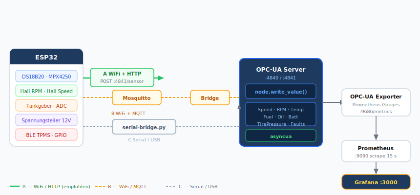
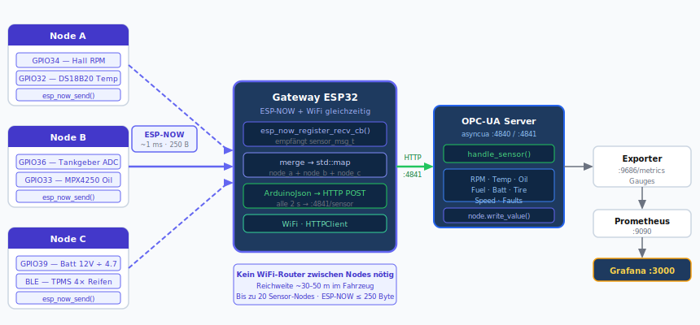

# Integration Docs

Dokumentation zur Anbindung externer Hardware (ESP32 + Sensoren) an den OPC-UA Server.

## Inhalt

| Dokument                                   | Beschreibung                                                       |
|--------------------------------------------|--------------------------------------------------------------------|
| [esp32-wifi-http.md](esp32-wifi-http.md)   | **A** — ESP32 sendet JSON via WiFi HTTP POST (Einstieg)            |
| [esp32-mqtt.md](esp32-mqtt.md)             | **B** — ESP32 → Mosquitto MQTT → OPC-UA Bridge (Produktion)        |
| [esp32-serial.md](esp32-serial.md)         | **C** — ESP32 Serial USB → Python Bridge (Werkstatt)               |
| [esp32-espnow.md](esp32-espnow.md)         | **D** — Mehrere ESP32 via ESP-NOW → Gateway → OPC-UA (empfohlen)   |
| [sensors-vehicle.md](sensors-vehicle.md)   | Sensorauswahl mit AliExpress-Links                                 |

## Vergleich

|                     | A — WiFi/HTTP    | B — WiFi/MQTT      | C — Serial/USB   | D — ESP-NOW          |
|---------------------|------------------|--------------------|------------------|----------------------|
| Aufwand             | Gering           | Mittel             | Gering           | Mittel               |
| Netzwerk            | WiFi             | WiFi               | keins            | Kein Router nötig    |
| Offline-Pufferung   | Nein             | Ja (QoS)           | Nein             | Ja (Gateway)         |
| Mehrere ESP32       | Möglich          | Ideal              | Nein             | Ideal (bis 20 Nodes) |
| Stack-Änderung      | +1 HTTP-Endpoint | +Mosquitto +Bridge | +pyserial Script | Nur Gateway-Firmware |
| Produktionstauglich | Eingeschränkt    | Ja                 | Nein             | Ja                   |

## Datenfluss (alle Optionen)





```plaintext
ESP32 + Sensoren
      │
      │  (A) HTTP POST JSON
      │  (B) MQTT publish
      │  (C) Serial JSON
      │  (D) ESP-NOW → Gateway → HTTP POST
      ▼
OPC-UA Server (opcua-server:4840)
      │  node.write_value()
      ▼
Prometheus Exporter → Prometheus → Grafana
```

## Voraussetzungen

- Arduino IDE oder PlatformIO
- ESP32-Board (z. B. ESP32-DevKitC, WROOM-32)
- Bibliotheken: `ArduinoJson`, `WiFi`, `HTTPClient` (alle im Arduino Board Manager / Library Manager)
