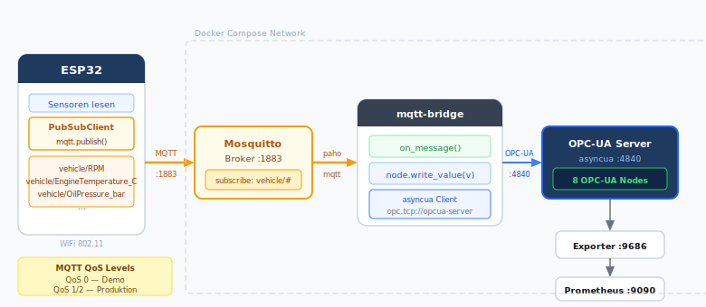

# Option B — ESP32 via WiFi + MQTT

**Empfohlen für:** produktionsnahe Setups, mehrere ESP32-Boards, Offline-Szenarien.

Der ESP32 publiziert Sensorwerte auf einem MQTT-Broker (Mosquitto). Ein Bridge-Service
abonniert die Topics und schreibt die Werte per `asyncua` in den OPC-UA Server.

## Architektur



---

## 1. compose.yml erweitern

```yaml
services:
  mosquitto:
    image: eclipse-mosquitto:2
    container_name: mosquitto
    volumes:
      - ./mosquitto/mosquitto.conf:/mosquitto/config/mosquitto.conf
    ports:
      - "1883:1883"
    restart: unless-stopped

  mqtt-bridge:
    build: ./mqtt-bridge
    container_name: mqtt-bridge
    environment:
      - MQTT_BROKER=mosquitto
      - OPCUA_ENDPOINT=opc.tcp://opcua-server:4840/vehicle/
    depends_on:
      - mosquitto
      - opcua-server
    restart: unless-stopped
```

---

## 2. Mosquitto-Konfiguration

**`mosquitto/mosquitto.conf`**

```conf
listener 1883
allow_anonymous true
```

Für Produktion: `allow_anonymous false` mit Passwortdatei.

---

## 3. MQTT-Bridge: `mqtt-bridge/bridge.py`

```python
import asyncio, os, logging
import paho.mqtt.client as mqtt
from asyncua import Client

logging.basicConfig(level=logging.INFO)

BROKER   = os.getenv("MQTT_BROKER", "localhost")
ENDPOINT = os.getenv("OPCUA_ENDPOINT", "opc.tcp://opcua-server:4840/vehicle/")
TOPIC    = "vehicle/#"

# OPC-UA Node-Objekte (befüllt nach Connect)
nodes: dict = {}
loop: asyncio.AbstractEventLoop


def on_connect(client, userdata, flags, rc):
    logging.info("MQTT connected rc=%d", rc)
    client.subscribe(TOPIC)


def on_message(client, userdata, msg):
    """Wird aufgerufen wenn eine MQTT-Nachricht eintrifft."""
    node_name = msg.topic.split("/")[-1]   # vehicle/RPM → RPM
    try:
        value = float(msg.payload.decode())
    except ValueError:
        return

    if node_name in nodes:
        asyncio.run_coroutine_threadsafe(
            nodes[node_name].write_value(value), loop
        )
        logging.debug("write %s = %s", node_name, value)


async def main():
    global loop, nodes
    loop = asyncio.get_running_loop()

    # OPC-UA verbinden und Nodes cachen
    async with Client(url=ENDPOINT) as client:
        ns = await client.get_namespace_index("http://demo.vehicle/opcua")
        vehicle = await client.nodes.objects.get_child([f"{ns}:Vehicle"])

        for name in ["Speed_kmh", "RPM", "EngineTemperature_C", "FuelLevel_pct",
                     "OilPressure_bar", "BatteryVoltage_V", "TirePressure_bar",
                     "ActiveFaultCount"]:
            nodes[name] = await vehicle.get_child(f"{ns}:{name}")

        logging.info("OPC-UA nodes cached: %s", list(nodes.keys()))

        # MQTT-Client starten (läuft in eigenem Thread)
        mqttc = mqtt.Client()
        mqttc.on_connect = on_connect
        mqttc.on_message = on_message
        mqttc.connect(BROKER, 1883, 60)
        mqttc.loop_start()

        # Offen halten
        while True:
            await asyncio.sleep(1)


asyncio.run(main())
```

**`mqtt-bridge/Dockerfile`**

```dockerfile
FROM python:3.12-slim
WORKDIR /app
RUN pip install --no-cache-dir asyncua==1.1.5 paho-mqtt==2.1.0
COPY bridge.py .
CMD ["python", "bridge.py"]
```

---

## 4. ESP32 Arduino Sketch

### Bibliotheken

- `PubSubClient` by Nick O'Leary
- `ArduinoJson`

```cpp
#include <WiFi.h>
#include <PubSubClient.h>
#include <ArduinoJson.h>

const char* WIFI_SSID  = "DEIN-WLAN";
const char* WIFI_PASS  = "DEIN-PASSWORT";
const char* MQTT_HOST  = "192.168.1.100";   // IP des Hosts anpassen
const int   MQTT_PORT  = 1883;

WiFiClient   wifiClient;
PubSubClient mqtt(wifiClient);

void connectMqtt() {
    while (!mqtt.connected()) {
        Serial.print("MQTT connecting…");
        if (mqtt.connect("esp32-vehicle")) {
            Serial.println(" OK");
        } else {
            Serial.printf(" failed rc=%d, retry in 5s\n", mqtt.state());
            delay(5000);
        }
    }
}

void setup() {
    Serial.begin(115200);
    WiFi.begin(WIFI_SSID, WIFI_PASS);
    while (WiFi.status() != WL_CONNECTED) { delay(500); Serial.print("."); }
    Serial.println("\nWiFi OK: " + WiFi.localIP().toString());

    mqtt.setServer(MQTT_HOST, MQTT_PORT);
}

void loop() {
    if (!mqtt.connected()) connectMqtt();
    mqtt.loop();

    // Sensoren lesen (Platzhalter — echte Sensor-Libs einbauen)
    float rpm     = 2400.0;
    float temp    = 82.5;
    float oil     = 3.1;
    float fuel    = 68.0;
    float batt    = 13.8;

    // Je ein MQTT-Topic pro Wert — Bridge empfängt vehicle/#
    mqtt.publish("vehicle/RPM",                  String(rpm).c_str());
    mqtt.publish("vehicle/EngineTemperature_C",  String(temp).c_str());
    mqtt.publish("vehicle/OilPressure_bar",      String(oil).c_str());
    mqtt.publish("vehicle/FuelLevel_pct",        String(fuel).c_str());
    mqtt.publish("vehicle/BatteryVoltage_V",     String(batt).c_str());

    delay(2000);
}
```

---

## 5. Testen ohne ESP32

```bash
# MQTT-Nachricht manuell senden (mosquitto_pub im Broker-Container)
docker exec mosquitto mosquitto_pub -h localhost -t vehicle/RPM -m 3200
docker exec mosquitto mosquitto_pub -h localhost -t vehicle/EngineTemperature_C -m 85.0
```

---

## Vorteile gegenüber Option A

| Feature | HTTP | MQTT |
|---|---|---|
| Offline-Pufferung | Nein | Ja (QoS 1/2) |
| Mehrere Boards | Manuell | Automatisch (Topics) |
| Bidirektional | Nein | Ja (subscribe) |
| Broker-Overhead | Keiner | Mosquitto Container |
