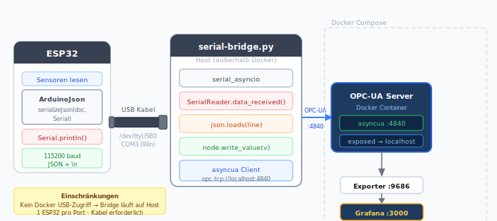

# Option C — ESP32 via Serial / USB

**Empfohlen für:** Werkstatt-Diagnose, kein WLAN vorhanden, direkte PC-Verbindung.

Der ESP32 sendet JSON-Zeilen über die USB-Serial-Verbindung.
Ein Python-Script auf dem Host liest den Port und schreibt die Werte per `asyncua` in den OPC-UA Server.

## Architektur



> Der Bridge läuft auf dem **Host** (nicht im Container), da Docker keinen direkten USB-Zugriff hat.
> Port 4840 muss erreichbar sein — ist bereits in compose.yml exposed.

---

## 1. Host-Seite: `serial-bridge.py`

```python
#!/usr/bin/env python3
"""
Liest JSON-Zeilen vom ESP32 (Serial) und schreibt sie in OPC-UA Nodes.
Ausführen: python3 serial-bridge.py --port /dev/tty.usbserial-0001
"""
import asyncio, json, logging, argparse
import serial_asyncio
from asyncua import Client

logging.basicConfig(level=logging.INFO, format="%(asctime)s %(message)s")

OPCUA_ENDPOINT = "opc.tcp://localhost:4840/vehicle/"
NAMESPACE_URI  = "http://demo.vehicle/opcua"

NODE_NAMES = [
    "Speed_kmh", "RPM", "EngineTemperature_C", "FuelLevel_pct",
    "OilPressure_bar", "BatteryVoltage_V", "TirePressure_bar", "ActiveFaultCount",
]


class SerialReader(asyncio.Protocol):
    def __init__(self, nodes: dict):
        self.nodes  = nodes
        self.buffer = b""

    def data_received(self, data: bytes):
        self.buffer += data
        while b"\n" in self.buffer:
            line, self.buffer = self.buffer.split(b"\n", 1)
            asyncio.ensure_future(self.process(line.strip()))

    async def process(self, line: bytes):
        try:
            payload = json.loads(line)
        except json.JSONDecodeError:
            logging.warning("Invalid JSON: %s", line[:80])
            return

        for key, value in payload.items():
            if key in self.nodes:
                await self.nodes[key].write_value(float(value))
                logging.debug("  %s = %s", key, value)

        logging.info("RX: %s", {k: payload[k] for k in payload if k in self.nodes})


async def main(port: str, baud: int):
    async with Client(url=OPCUA_ENDPOINT) as client:
        ns = await client.get_namespace_index(NAMESPACE_URI)
        vehicle = await client.nodes.objects.get_child([f"{ns}:Vehicle"])

        nodes = {}
        for name in NODE_NAMES:
            nodes[name] = await vehicle.get_child(f"{ns}:{name}")
        logging.info("Connected to OPC-UA, nodes cached")

        loop = asyncio.get_running_loop()
        transport, _ = await serial_asyncio.create_serial_connection(
            loop,
            lambda: SerialReader(nodes),
            port, baudrate=baud
        )
        logging.info("Serial open: %s @ %d baud", port, baud)

        # Läuft bis CTRL+C
        await asyncio.Event().wait()


if __name__ == "__main__":
    ap = argparse.ArgumentParser()
    ap.add_argument("--port", default="/dev/tty.usbserial-0001",
                    help="Serieller Port, z. B. /dev/ttyUSB0 oder COM3")
    ap.add_argument("--baud", type=int, default=115200)
    args = ap.parse_args()

    try:
        asyncio.run(main(args.port, args.baud))
    except KeyboardInterrupt:
        logging.info("Bridge gestoppt")
```

### Abhängigkeiten installieren (Host)

```bash
pip install asyncua pyserial-asyncio
```

### Starten

```bash
# macOS / Linux
python3 serial-bridge.py --port /dev/tty.usbserial-0001

# Windows
python3 serial-bridge.py --port COM3
```

Port-Namen ermitteln:
```bash
# macOS
ls /dev/tty.usb*

# Linux
ls /dev/ttyUSB* /dev/ttyACM*

# Windows (PowerShell)
Get-PnpDevice -Class Ports | Select Name
```

---

## 2. ESP32 Arduino Sketch

```cpp
#include <ArduinoJson.h>

// Sensor-Pins
#define RPM_PIN  34
#define TEMP_PIN 32   // DS18B20 — OneWire
// ... weitere Pins

volatile uint32_t pulseCount = 0;
void IRAM_ATTR onPulse() { pulseCount++; }

void setup() {
    Serial.begin(115200);
    pinMode(RPM_PIN, INPUT_PULLUP);
    attachInterrupt(digitalPinToInterrupt(RPM_PIN), onPulse, RISING);
    // Sensor-Inits …
}

void loop() {
    // RPM berechnen
    uint32_t p = pulseCount;
    pulseCount  = 0;
    float rpm   = p * 30.0f;   // Pulse/Sek × 60 / 2 (4-Takt)

    // Sensor-Werte lesen
    float temp  = 82.0;   // readDS18B20();
    float oil   = 3.1;    // readOilPressure();
    float fuel  = 70.0;   // readFuelLevel();
    float batt  = 13.8;   // readBattVoltage();

    // JSON ausgeben
    JsonDocument doc;
    doc["RPM"]                 = (int)rpm;
    doc["EngineTemperature_C"] = temp;
    doc["OilPressure_bar"]     = oil;
    doc["FuelLevel_pct"]       = fuel;
    doc["BatteryVoltage_V"]    = batt;

    serializeJson(doc, Serial);
    Serial.println();   // Newline als Trennzeichen

    delay(2000);
}
```

---

## Einschränkungen

- Nur **ein** ESP32 pro Host-Port
- Bridge muss manuell gestartet werden (kein Container)
- Kein Remote-Betrieb (Kabel erforderlich)
- Bei USB-Disconnect: Bridge neu starten

Für Dauerbetrieb als systemd-Service einrichten (Linux) oder Task Scheduler (Windows).
