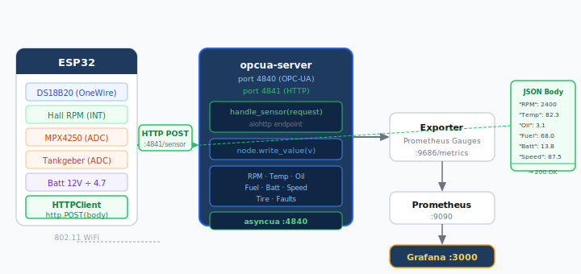

# Option A — ESP32 via WiFi + HTTP POST

**Empfohlen für:** schnellen Einstieg, einzelner ESP32, Demo-Umgebung.

Der ESP32 liest Sensoren aus und sendet alle 2 Sekunden ein JSON-Objekt per HTTP POST
an einen neuen Endpoint im OPC-UA Server. Dieser schreibt die Werte direkt in die OPC-UA Nodes.

## Architektur



Port 4841 wird für HTTP genutzt, damit OPC-UA auf 4840 unverändert bleibt.

---

## 1. Server-Seite: `opcua-server/server.py` erweitern

`aiohttp` zu den Abhängigkeiten hinzufügen und einen HTTP-Endpoint einbauen,
der empfangene JSON-Felder direkt in die OPC-UA Nodes schreibt.

### Dockerfile anpassen

```dockerfile
RUN pip install --no-cache-dir asyncua==1.1.5 aiohttp==3.9.5
```

### server.py — HTTP-Endpoint (Ergänzung)

Den folgenden Block **nach** der Node-Deklaration einfügen, bevor `async with server:` beginnt:

```python
from aiohttp import web

# Map: JSON-Feldname → OPC-UA Node-Objekt
NODE_MAP: dict  # wird nach Node-Deklaration befüllt

async def handle_sensor(request):
    """Empfängt JSON vom ESP32 und schreibt Werte in OPC-UA Nodes."""
    try:
        data = await request.json()
    except Exception:
        return web.Response(status=400, text='{"error":"invalid json"}',
                            content_type="application/json")

    updated = []
    for key, node in NODE_MAP.items():
        if key in data:
            try:
                await node.write_value(float(data[key]))
                updated.append(key)
            except Exception as e:
                logging.warning("write_value %s failed: %s", key, e)

    return web.Response(
        text=f'{{"ok":true,"updated":{updated}}}',
        content_type="application/json"
    )

async def start_http(app_nodes):
    global NODE_MAP
    NODE_MAP = app_nodes
    app = web.Application()
    app.router.add_post("/sensor", handle_sensor)
    runner = web.AppRunner(app)
    await runner.setup()
    await web.TCPSite(runner, "0.0.0.0", 4841).start()
    logging.info("HTTP sensor endpoint: http://0.0.0.0:4841/sensor")
```

Und in `main()` nach der Node-Deklaration aufrufen:

```python
await start_http({
    "Speed_kmh":          speed,
    "RPM":                rpm,
    "EngineTemperature_C":engine_temp,
    "FuelLevel_pct":      fuel_level,
    "OilPressure_bar":    oil_pressure,
    "BatteryVoltage_V":   battery_voltage,
    "TirePressure_bar":   tire_pressure,
    "ActiveFaultCount":   fault_count,
})
```

### compose.yml — Port 4841 freigeben

```yaml
opcua-server:
  ports:
    - "4840:4840"
    - "4841:4841"   # HTTP sensor endpoint
```

---

## 2. ESP32-Seite: Arduino Sketch

### Bibliotheken (Library Manager)

- `ArduinoJson` by Benoit Blanchon (≥ v7)
- `WiFi` (im ESP32 Board Package enthalten)
- `HTTPClient` (im ESP32 Board Package enthalten)
- Sensor-spezifisch: `DallasTemperature` + `OneWire` für DS18B20

### Sketch: `vehicle_sensor.ino`

```cpp
#include <WiFi.h>
#include <HTTPClient.h>
#include <ArduinoJson.h>
#include <OneWire.h>
#include <DallasTemperature.h>

// ── Konfiguration ────────────────────────────────────────────────────────────
const char* WIFI_SSID   = "DEIN-WLAN";
const char* WIFI_PASS   = "DEIN-PASSWORT";
const char* SERVER_URL  = "http://192.168.1.100:4841/sensor";  // IP anpassen!
const int   SEND_INTERVAL_MS = 2000;

// ── Pins ─────────────────────────────────────────────────────────────────────
#define RPM_PIN       34   // Hall-Sensor (Kurbelwelle) — interrupt-fähig
#define DS18B20_PIN   32   // Kühlwassertemperatur
#define OIL_PIN       35   // Öldrucksensor (0–5 V → ADC)
#define FUEL_PIN      36   // Tankgeber (Poti, 0–5 V → ADC)
#define BATT_PIN      39   // Batteriespannung (Spannungsteiler)

// ── RPM via Interrupt ────────────────────────────────────────────────────────
volatile uint32_t pulseCount = 0;
unsigned long     lastRpmCalc = 0;

void IRAM_ATTR onRpmPulse() { pulseCount++; }

// ── DS18B20 ──────────────────────────────────────────────────────────────────
OneWire           oneWire(DS18B20_PIN);
DallasTemperature tempSensor(&oneWire);

// ── ADC-Hilfsfunktion (12 bit, 3.3 V Ref) ────────────────────────────────────
float adcToVolt(int pin) {
    return analogRead(pin) * (3.3f / 4095.0f);
}

void setup() {
    Serial.begin(115200);

    // Sensoren initialisieren
    tempSensor.begin();
    pinMode(RPM_PIN, INPUT_PULLUP);
    attachInterrupt(digitalPinToInterrupt(RPM_PIN), onRpmPulse, RISING);

    // WiFi verbinden
    WiFi.begin(WIFI_SSID, WIFI_PASS);
    Serial.print("Connecting WiFi");
    while (WiFi.status() != WL_CONNECTED) {
        delay(500);
        Serial.print(".");
    }
    Serial.println("\nIP: " + WiFi.localIP().toString());
}

void loop() {
    unsigned long now = millis();

    // ── RPM berechnen ────────────────────────────────────────────────────────
    float elapsed = (now - lastRpmCalc) / 1000.0f;
    uint32_t pulses = pulseCount;
    pulseCount = 0;
    lastRpmCalc = now;
    // 2 Impulse pro Umdrehung (4-Takt), an Motortyp anpassen
    float rpm = (pulses / elapsed) * 60.0f / 2.0f;

    // ── Kühlwassertemperatur ─────────────────────────────────────────────────
    tempSensor.requestTemperatures();
    float coolantTemp = tempSensor.getTempCByIndex(0);

    // ── Öldruck: MPX4250 → 0–2.5 V → 0–250 kPa → 0–2.5 bar ────────────────
    float oilVolt = adcToVolt(OIL_PIN);
    float oilBar  = (oilVolt / 2.5f) * 2.5f;

    // ── Tankgeber: Widerstandspoti 0–180 Ω → Spannungsteiler ─────────────────
    float fuelVolt  = adcToVolt(FUEL_PIN);
    float fuelLevel = (fuelVolt / 3.3f) * 100.0f;   // grobe Linearisierung

    // ── Batteriespannung: Spannungsteiler 10 kΩ / 3.3 kΩ (max 15 V → 3.3 V) ─
    float battRaw  = adcToVolt(BATT_PIN);
    float battVolt = battRaw * ((10.0f + 3.3f) / 3.3f);

    // ── JSON bauen ───────────────────────────────────────────────────────────
    JsonDocument doc;
    doc["RPM"]                  = (int)rpm;
    doc["EngineTemperature_C"]  = coolantTemp;
    doc["OilPressure_bar"]      = oilBar;
    doc["FuelLevel_pct"]        = fuelLevel;
    doc["BatteryVoltage_V"]     = battVolt;
    // Speed_kmh und TirePressure_bar: hier Platzhalter oder weitere Sensoren
    // doc["Speed_kmh"]          = calcSpeedFromVSS();
    // doc["TirePressure_bar"]   = readBLE_TPMS();

    String body;
    serializeJson(doc, body);
    Serial.println("TX: " + body);

    // ── HTTP POST ────────────────────────────────────────────────────────────
    if (WiFi.status() == WL_CONNECTED) {
        HTTPClient http;
        http.begin(SERVER_URL);
        http.addHeader("Content-Type", "application/json");
        http.setTimeout(1500);
        int code = http.POST(body);
        if (code > 0) {
            Serial.printf("HTTP %d: %s\n", code, http.getString().c_str());
        } else {
            Serial.printf("HTTP error: %s\n", http.errorToString(code).c_str());
        }
        http.end();
    } else {
        Serial.println("WiFi disconnected, reconnecting…");
        WiFi.reconnect();
    }

    delay(SEND_INTERVAL_MS);
}
```

---

## 3. Spannungsteiler für 12-V-Messung

Das ESP32-ADC verträgt max. 3.3 V. Für die 12–15 V Kfz-Bordnetz:

```plaintext
12–15 V ──┬── 10 kΩ ──┬── 3.3 kΩ ── GND
          │           │
         (Bat+)    GPIO39 (BATT_PIN)
```

Ausgangsspannung bei 14.4 V: `14.4 × 3.3 / (10 + 3.3) ≈ 3.57 V` → zu hoch!
Sicherere Werte: **10 kΩ / 2.7 kΩ** → max. `15 × 2.7/12.7 ≈ 3.19 V` ✓

---

## 4. Testen ohne echte Sensoren

Zum Testen direkt mit `curl`:

```bash
curl -X POST http://localhost:4841/sensor \
  -H "Content-Type: application/json" \
  -d '{"RPM": 3200, "EngineTemperature_C": 78.5, "OilPressure_bar": 3.1,
       "FuelLevel_pct": 67.0, "BatteryVoltage_V": 13.9}'
```

---

## 5. Rebuild

```bash
docker compose up -d --build opcua-server
```
