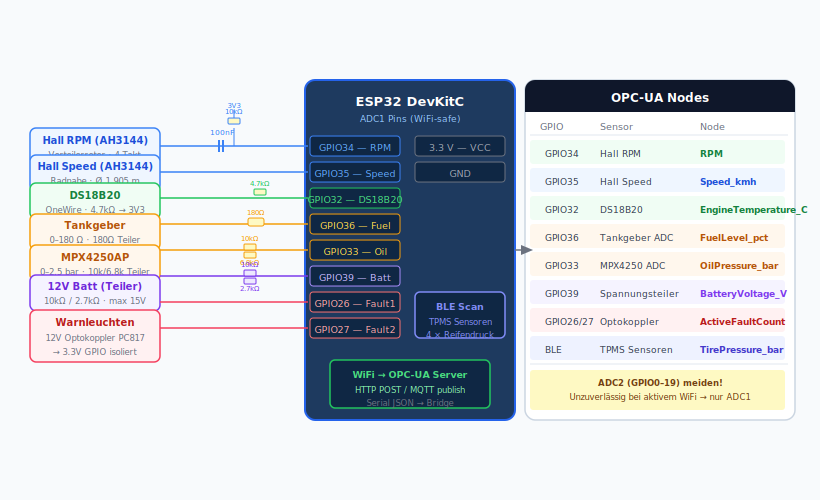

# Sensorauswahl

Empfohlene Sensoren für die 8 OPC-UA Nodes.
Alle Sensoren sind für ESP32 (3.3 V, ADC/GPIO/OneWire) geeignet.

---

## Konkrete Sensorliste

| OPC-UA Node           | Bauteil / Modul            | AliExpress                                                                                                             | Preis (ca.) |
|-----------------------|----------------------------|------------------------------------------------------------------------------------------------------------------------|-------------|
| `RPM`                 | AH3144E Hall-Sensor        | [AH3144E Hall effect sensor](https://www.aliexpress.com/wholesale?SearchText=AH3144E+Hall+effect+sensor)               | 0,10–0,30 € |
| `Speed_kmh`           | AH3144E Hall-Sensor        | [AH3144E Hall effect sensor](https://www.aliexpress.com/wholesale?SearchText=AH3144E+Hall+effect+sensor)               | 0,10–0,30 € |
| `EngineTemperature_C` | DS18B20 Edelstahlsonde     | [DS18B20 waterproof sensor](https://www.aliexpress.com/wholesale?SearchText=DS18B20+waterproof+temperature+sensor)     | 0,80–1,50 € |
| `OilPressure_bar`     | MPX4250AP Drucksensor      | [MPX4250AP pressure sensor](https://www.aliexpress.com/wholesale?SearchText=MPX4250AP+pressure+sensor)                 | 3–6 €       |
| `BatteryVoltage_V`    | 10 kΩ + 2,7 kΩ Widerstände | [metal film resistor kit](https://www.aliexpress.com/wholesale?SearchText=metal+film+resistor+10k+2.7k+kit)            | < 0,50 €    |
| `FuelLevel_pct`       | Kraftstoffgeber 0–190 Ω    | [fuel level sender 0-190 ohm](https://www.aliexpress.com/wholesale?SearchText=fuel+level+sender+0-190+ohm+float)       | 5–12 €      |
| `TirePressure_bar`    | BLE TPMS 4er-Set           | [TPMS Bluetooth sensor](https://www.aliexpress.com/wholesale?SearchText=TPMS+Bluetooth+tire+pressure+sensor)           | 15–25 €     |
| `ActiveFaultCount`    | PC817 Optokoppler          | [PC817 optocoupler](https://www.aliexpress.com/wholesale?SearchText=PC817+optocoupler+10pcs)                           | 0,50 €/10St |

> Preise Stand 2024, AliExpress (Versand aus CN, ca. 2–4 Wochen). Für schnellere Lieferung Filter „Ships from DE/EU" setzen.

---

## Übersicht

| OPC-UA Node           | Sensor               | Interface | Preis (ca.) |
|-----------------------|----------------------|-----------|-------------|
| `Speed_kmh`           | AH3144E + Magnet     | GPIO INT  | 0,60 €      |
| `RPM`                 | AH3144E + Magnet     | GPIO INT  | 0,60 €      |
| `EngineTemperature_C` | DS18B20 Sonde        | OneWire   | 3,50 €      |
| `FuelLevel_pct`       | VDO 224-011          | ADC       | 15–25 €     |
| `OilPressure_bar`     | MPX4250AP            | ADC       | 9,00 €      |
| `BatteryVoltage_V`    | Spannungsteiler      | ADC       | < 0,10 €    |
| `TirePressure_bar`    | Tymate TY06 BLE      | BLE       | 25–35 €     |
| `ActiveFaultCount`    | PC817 Optokoppler    | GPIO      | 0,15 €      |

---

## Detailbeschreibung

### Speed_kmh — Raddrehzahl

Ein Hallsensor (z. B. AH3144 oder KY-003) mit kleinem Neodym-Magnet an der Radnabe.
Pro Umdrehung 1 Impuls → Geschwindigkeit aus Radumfang berechnen.

```plaintext
v [km/h] = (Impulse/Sek × Radumfang [m] × 3.6)
Radumfang 1974 typ.: 165R15 → ca. 1.905 m
```

**Verkabelung:**

```plaintext
AH3144  VCC → 3.3 V
        GND → GND
        OUT → GPIO34 (mit 10 kΩ Pull-up)
```

---

### RPM — Motordrehzahl

Hallsensor am Verteilerrotor (1 Impuls pro Zündung, 4-Takt = 2 Impulse/Umdrehung).
Alternativ: Induktiver Sensor am Schwungrad.

```math
\mathrm{RPM}=\frac{\text{Impulse/s}\cdot 60}{2}\quad\text{(4-Takt-Faktor)}
```

> Achtung: Zündspannungsspitzen können Störungen verursachen.
> 100-nF-Kondensator zwischen Signal und GND empfohlen.

---

### EngineTemperature_C — Kühlwassertemperatur

**DS18B20** (wasserdichte Ausführung, Edelstahlhülse).
In den Kühlwasserkreislauf einschrauben (1/8" NPT Gewinde mit Adapter).

```plaintext
DS18B20  VCC  → 3.3 V
         GND  → GND
         DATA → GPIO32 (mit 4.7 kΩ Pull-up zu 3.3 V)
```

Alternativ: **NTC 10 kΩ** (Original-Kühlmittelsensor vieler 70er-Fahrzeuge) + Spannungsteiler.

```plaintext
3.3 V ── 10 kΩ (Festwiderstand) ──┬── NTC ── GND
                                  └── GPIO35 (ADC)
T [°C] aus Steinhart-Hart-Formel berechnen
```

---

### FuelLevel_pct — Kraftstoffstand

Der **Original-Tankgeber** ist meist ein Schwimmerpoti (0–180 Ω oder 0–90 Ω je nach Baujahr).
Mit Spannungsteiler an den ADC anschließen.

```plaintext
3.3 V ── 180 Ω ──┬── Tankgeber (0–180 Ω) ── GND
                 └── GPIO36 (ADC)

Leer:  Geber hochohmig → Spannung ≈ 3.3 V → 0 %
Voll:  Geber niederohmig → Spannung ≈ 0 V → 100 %
```

Kalibrierung im Code: Leerstand und Vollstand messen und interpolieren.

---

### OilPressure_bar — Öldruck

**Freescale/NXP MPX4250AP** — absoluter Drucksensor, 0–250 kPa (0–2.5 bar), 0.2–4.9 V Ausgang.

> Der Originalgeber älterer Fahrzeuge ist oft ein Druckschalter (An/Aus),
> kein analoger Sensor. Ersetzen durch MPX4250 + M10×1-Adapter.

```plaintext
MPX4250  VCC → 5 V (über Voltage Booster) oder 3.3 V (Ausgangsspannung passt sich an)
         GND → GND
         OUT → ADC (direkt, da max. 4.9 V > 3.3 V → Spannungsteiler nötig!)

Spannungsteiler: 10 kΩ / 6.8 kΩ → skaliert 4.9 V auf ≈ 3.3 V
```

Umrechnung:

```python
volt    = adc_value * (3.3 / 4095)
volt_in = volt * (10 + 6.8) / 6.8   # Rückrechnung Teiler
kPa     = (volt_in - 0.2) / 4.7 * 250
bar     = kPa / 100
```

---

### BatteryVoltage_V — Batteriespannung

Zwei Widerstände als Spannungsteiler (max. 15 V → 3.3 V).

```plaintext
Kfz-12V ──── 10 kΩ ────┬──── 2.7 kΩ ──── GND
                       └──── GPIO39 (ADC)

Faktor: (10 + 2.7) / 2.7 = 4.7
volt_battery = adc_volt * 4.7
```

Sicherung (100 mA) in Reihe empfohlen.

---

### TirePressure_bar — Reifendruck

**BLE-TPMS-Sensoren** (Reifendrucksensoren mit Bluetooth Low Energy).
Günstige Sets für ~15–30 € erhältlich (4 Sensoren, 0–3.5 bar, –40 bis 80 °C).

ESP32 liest via BLE-Scan:

```cpp
#include <BLEDevice.h>
#include <BLEUtils.h>
#include <BLEScan.h>

// TPMS-Sensoren senden Manufacturer-Data mit Druck und Temperatur
// Protokoll variiert je nach Hersteller — Bibliothek "ESP32 TPMS" verfügbar
```

> Alternativ: analoger Drucksensor **MPX5700AP** am Ventil-Schrader-Adapter.
> Aufwändiger, aber genauer.

---

### ActiveFaultCount — Fehlerzähler

1974er-Fahrzeuge haben kein OBD-II. Stattdessen: Warnleuchten aus dem Armaturenbrett auslesen.

```plaintext
Warnleuchte (12 V) ──── Optokoppler (PC817) ──── GPIO (3.3 V)

PC817  Anode    → 12 V über 1 kΩ
       Kathode  → Warnleuchten-Masse
       Emitter  → GND
       Collector → 3.3 V über 10 kΩ → GPIO
```

Jeder aktive Eingang zählt +1 → `ActiveFaultCount`.

---

## Empfohlene ESP32-Boards

| Board                    | Vorteil                                  | Link                 |
|--------------------------|------------------------------------------|----------------------|
| ESP32-DevKitC (WROOM-32) | Standard, günstig (~5 €), viele GPIOs    | Reichelt, AliExpress |
| ESP32-S3-DevKitC         | Mehr RAM, USB-OTG, kein Dongle nötig     | Mouser               |
| LILYGO T-Display-S3      | Integriertes Display für Cockpit-Anzeige | AliExpress           |

---

## Schaltungsempfehlung (Gesamtübersicht)



```plaintext
ESP32 DevKitC
├── GPIO34  ← Hall RPM (+ 100 nF GND, + 10 kΩ Pull-up)
├── GPIO35  ← Hall Speed (+ 100 nF GND, + 10 kΩ Pull-up)
├── GPIO32  ← DS18B20 DATA (+ 4.7 kΩ Pull-up 3.3 V)
├── GPIO36  ← Tankgeber ADC (Spannungsteiler)
├── GPIO33  ← Öldruck ADC (Spannungsteiler, MPX4250)
├── GPIO39  ← Batteriespannung ADC (Spannungsteiler 10k/2.7k)
├── GPIO26  ← Warnleuchte 1 (Optokoppler)
├── GPIO27  ← Warnleuchte 2 (Optokoppler)
└── 3.3 V / GND → Sensoren
```

Alle ADC-Pins auf ADC1 (GPIO32–39) — ADC2 ist bei aktivem WiFi unzuverlässig!
